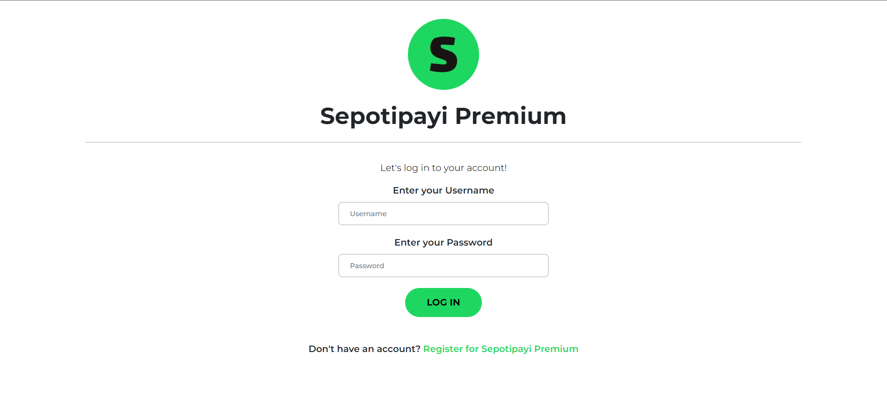
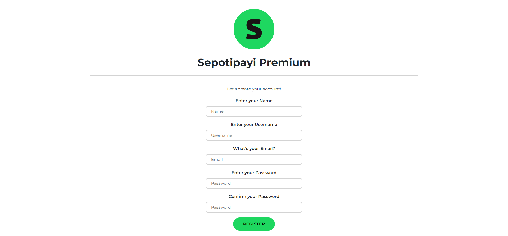
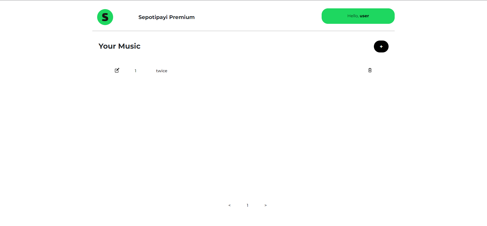
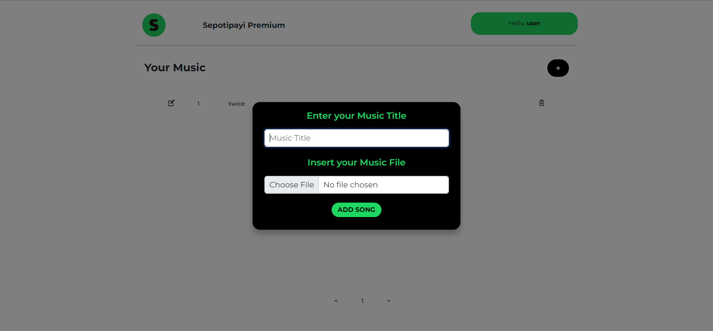
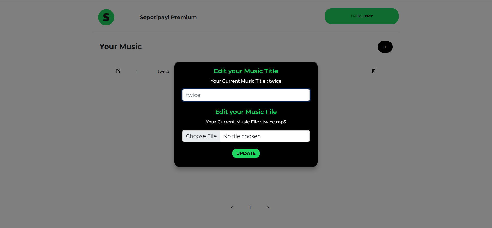
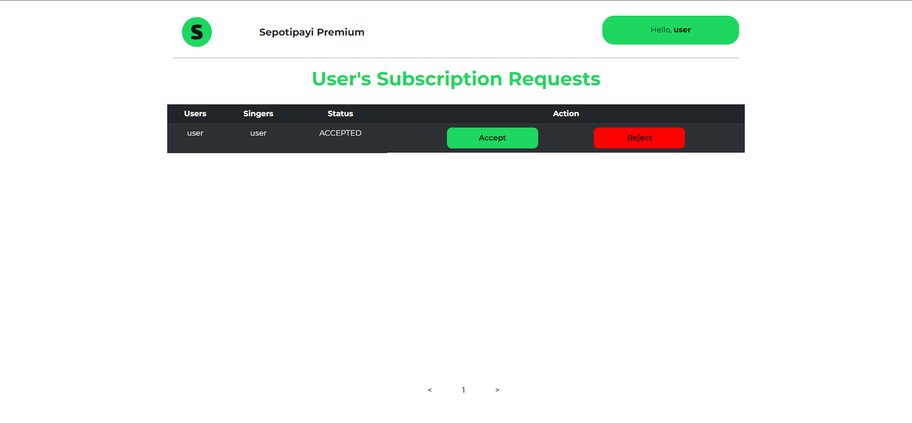

# Milestone 2 IF3110 Pengembangan Aplikasi Berbasis Web

## Deskripsi Aplikasi Web
Sepotipayi Premium App Service berperan sebagai Client dari aplikasi Sepotipayi Premium App sebagai aplikasi untuk melakukan pengelolaan lagu yang membutuhkan subscription. Premium App Service dibuat dengan menggunakan React TypeScript, Bootstrapp, dan Axios.

## Daftar Requirement

1. Autentikasi
2. Pengguna harus melakukan autentikasi untuk dapat mengakses seluruh fitur.
3. Pengguna dibedakan menjadi 2 kategori: penyanyi dan admin.
4. Seluruh pengguna yang terautentikasi juga harus dapat melakukan logout.
5. Penyanyi dapat melakukan pengelolaan lagu premium miliknya.
6. Admin Binotify Premium dapat melihat list permintaan subscription.
7. Admin Binotify Premium dapat menerima atau menolak permintaan subscription.

## Cara Menjalankan Client

> Perlu diperhatikan bahwa terdapat repository `sepotipayi-docker` untuk mempermudah menjalankan aplikasi secara sekaligus dan **disarankan** untuk menjalankan client melewati repository tersebut.

1. Pastikan docker desktop sudah dijalankan, disarankan untuk melakukan delete terlebih dahulu pada image MySQL yang sudah dimiliki sebelumnya
2. Jalankan perintah `docker-compose up --build`
3. Buka browser dan ketikkan `localhost:1920` pada address bar untuk melihat web yang dibuat

> Untuk melihat daftar port pada docker, jalankan perintah dapat dilihat pada aplikasi docker desktop sesuai dengan container yang dijalankan

## Screen Shot

### Login

### Register

### Singer Page

### Add Song

### Update Song

### Admin Page

## Pembagian Tugas

- Login: 13520044, 13520101
- Register: 13520044, 13520101
- Singer Page: 13520044, 13520083, 13520101
- Admin Page: 13520044, 13520083, 13520101
- Subscription Service: 13520044, 13520083, 13520101
- Songs Service: 13520044, 13520101
- Error Modal: 13520083, 13520101
